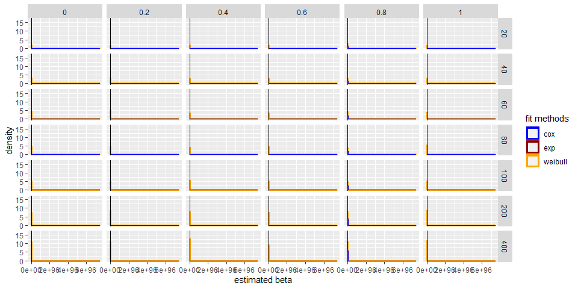
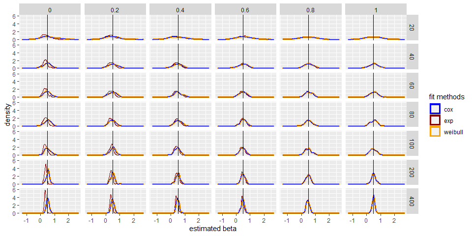

data_generation
================
Haolin Zhong
2022/2/8

``` r
library(tidyverse)
```

    ## -- Attaching packages --------------------------------------- tidyverse 1.3.1 --

    ## v ggplot2 3.3.5     v purrr   0.3.4
    ## v tibble  3.1.4     v dplyr   1.0.7
    ## v tidyr   1.1.3     v stringr 1.4.0
    ## v readr   2.0.1     v forcats 0.5.1

    ## -- Conflicts ------------------------------------------ tidyverse_conflicts() --
    ## x dplyr::filter() masks stats::filter()
    ## x dplyr::lag()    masks stats::lag()

``` r
library(caret)
```

    ## Warning: 程辑包'caret'是用R版本4.1.2 来建造的

    ## 载入需要的程辑包：lattice

    ## 
    ## 载入程辑包：'caret'

    ## The following object is masked from 'package:purrr':
    ## 
    ##     lift

``` r
library(survival)
```

    ## 
    ## 载入程辑包：'survival'

    ## The following object is masked from 'package:caret':
    ## 
    ##     cluster

## Culmulative Distribution of Time t

*S*(*t*) = ∫<sub>*t*</sub><sup>∞</sup>*f*(*t*)*d**t* = 1 − *F*(*t*)

$$h(t) = \\frac{f(t)}{S(t)} = \\frac{F'(t)}{1 - F(t)}$$

*F*(*t*) = 1 − exp(−∫<sub>0</sub><sup>*t*</sup>*h*(*s*)*d**s*) = 1 − exp\[−(∫<sub>0</sub><sup>*t*</sup>*h*<sub>0</sub>(*s*)*d**s*)⋅exp(*β*<sup>*T*</sup>*X*)\]

-   exponential proportional-hazards model:

$$F(t) = 1 - \\text{exp}\\left\[- \\lambda t \\cdot \\exp(\\beta^T X) \\right\] \\quad \\implies \\quad F^{-1}(x) = - \\frac{\\ln(1 - x)}{\\lambda \\exp(\\beta^TX)}$$

-   Weibull proportional-hazards model:

$$F(t) = 1 - \\text{exp}\\left\[- \\lambda t^{\\gamma} \\cdot \\exp(\\beta^T X) \\right\] \\quad \\implies \\quad F^{-1}(x) = \\left( - \\frac{\\ln(1 - x)}{\\lambda \\exp(\\beta^TX)}\\right) ^{\\frac 1 {\\gamma}}$$

## Data Generation

-   generate mixed random t under given sample size `n` and mixing
    proportion `p`:

    -   when `p = 1`, use pure exponential distribution

    -   when `p = 0`, use pure weibull distribution

    -   This function use lambda = 0.5, gamma = 1.5 as default

    -   In later analysis we will always use `b1 = 0.5` as the treatment
        effect.

``` r
simdat = function(n, p, lambda = 0.5, gamma = 1.5, eff = list()) {
  # randomly assign group
  x1 = rbinom(n, 1, 0.5)
  
  u = runif(n)
  useExp = runif(n) < p 
  # generating mixed data
  t =  useExp * (-log(u) / (lambda * exp(eff$b1 * x1))) + (1 - useExp) * (-log(u) / (lambda * exp(eff$b1 * x1)))^(1 / gamma)
  
  # two features
  # x2 = rbinom(n, 1, 0.5)
  # t =  useExp * (-log(u) / (lambda * exp(eff$b1 * x1))) + (1 - useExp) * (-log(u) / (lambda * exp(eff$b2 * x2)))^(1 / gamma)
  
  t[t < 1/365] = 1/365
  t[t == 1 / 365] = t[t == 1 / 365] + rnorm(length(t[t == 1 / 365]), 0, 1e-4)
  t = abs(t)
  
  e = as.numeric(t < 5)
  t = pmin(t, 5)
  
  name = paste("n =", n, ", p =", p, ", eff =", eff[[1]])
  
  return(tibble(name = name, time = t, event = e, x1 = x1))
  # two features
  # return(tibble(name = name, time = t, event = e, x1 = x1, x2 = x2))
}
```

-   test:

``` r
data = simdat(500, 1, eff = list(b1 = 0.5))

data %>% 
  ggplot() +
  geom_density(aes(x = time))
```

<!-- -->

## fit function

``` r
fit_exp = function(df) {
  fit.exponential = survreg(Surv(time, event) ~ x1, dist = "exponential", data = df)
  return(as.numeric(-fit.exponential$coefficients[-1]))
}

fit_weibull = function(df) {
  fit.weibull <- survreg(Surv(time, event) ~ x1, dist = "weibull", data = df)
  return(as.numeric(-fit.weibull$coefficients[-1] / fit.weibull$scale))
}

fit_cox = function(df) {
  fit.cox <- coxph(Surv(time, event) ~ x1, data = df)
  return(as.numeric(fit.cox$coefficients))
}
```

## The distribution of estimated beta

-   visualization:

``` r
param_grid = expand.grid(p = seq(0, 1, by = 0.2), n = c(20, 40, 60, 80, 100, 200, 400), rep = 1:100)

sim_dat = param_grid %>% 
  mutate(
    data = map2(n, p, ~simdat(n = .x, p = .y, eff = list(b1 = 0.5)))
  ) %>% 
  mutate(
    b_exp = map_dbl(data, fit_exp),
    b_weibull = map_dbl(data, fit_weibull),
    b_cox = map_dbl(data, fit_cox)
  )

sim_dat %>% 
  ggplot() +
  geom_density(aes(x = b_exp, color = "darkred"), alpha = 0.6) +
  geom_density(aes(x = b_weibull, color = "orange" ), size = 1.2) +
  geom_density(aes(x = b_cox, color = "blue"), alpha = 0.3) +
  geom_vline(xintercept = 0.5) +
  facet_grid(n~p) +
  xlab("estimated beta") +
  scale_colour_manual(name = 'fit methods', 
        values =c('blue'='blue','darkred'='darkred', 'orange' = 'orange'), labels = c('cox','exp', 'weibull'))
```

<!-- -->

-   metrics:

    -   MSE may reflect accuracy: (the trend is indeed very obvious)

``` r
mse = sim_dat %>% 
  select(-data, -rep) %>%
  mutate(
    b_exp = (b_exp - 0.5)^2,
    b_weibull = (b_weibull - 0.5)^2,
    b_cox = (b_cox - 0.5)^2
  ) %>% 
  group_by(n, p) %>% 
  summarize(
    exp_mse = mean(b_exp),
    weibull_mse = mean(b_weibull),
    cox_mse = mean(b_cox)
  ) %>% 
  pivot_longer("exp_mse":"cox_mse", names_to = "fit_method", values_to = "mse") %>% 
  mutate(fit_method = as.factor(fit_method)) 
```

    ## `summarise()` has grouped output by 'n'. You can override using the `.groups` argument.

``` r
ggplot(mse, aes(x = n, y = mse, color = fit_method)) +
  geom_point() +
  geom_line() +
  facet_grid("p")
```

<!-- -->
